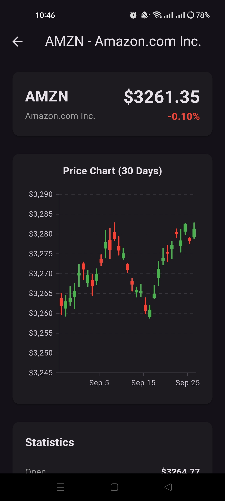
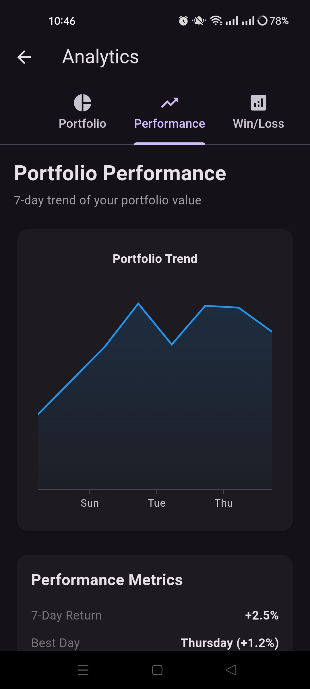
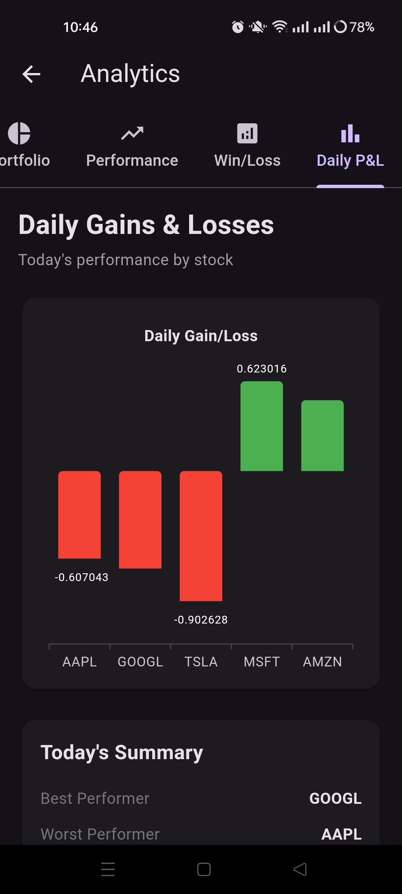

# 📱 Flutter Trading App

<div align="center">
  
  
  
  
  
  **A modern, feature-rich mobile trading application built with Flutter**
  
  *Practice trading without risk in a beautifully designed, professional interface*

  [](https://www.youtube.com/watch?v=CTuRE5X5Ew8&list=LL)

</div>

---

## 🌟 Overview

This Flutter trading application prototype demonstrates a complete mobile trading experience with real-time data visualization, paper trading capabilities, and a sleek, modern interface. Built entirely with Flutter widgets, the app showcases best practices in mobile finance app development.

## 🎬 Demo Video

<div align="center">
  
  [](https://www.youtube.com/watch?v=CTuRE5X5Ew8&list=LL)
  
  *Click the thumbnail above to watch the full demo on YouTube*
  
</div>

**What you'll see in the demo:**
- 📊 Real-time stock charts in action
- 💰 Paper trading workflow
- 🎨 Smooth UI animations and transitions  
- ⚡ App performance across different screens

## ✨ Features

### 📊 **Real-Time Trading**
- Live stock price updates
- Interactive candlestick charts
- Technical indicators & analysis tools
- Market depth visualization

### 💰 **Paper Trading**
- Risk-free practice environment
- Virtual portfolio management
- Real-time profit/loss tracking
- Trade history & analytics

### 🎨 **Modern UI/UX**
- Clean, intuitive interface
- Responsive design for all screen sizes
- Smooth animations & transitions
- Dark/Light theme support

### ⚡ **Performance**
- Optimized Flutter widgets
- Efficient state management
- Smooth 60fps animations
- Fast data loading & caching

## 📱 Screenshots

<div align="left">
  <table>
    <tr>
      <td></td>
      <td></td>
      <td></td>
      <td></td>

  </table>
</div>

## 🚀 Getting Started

### Prerequisites

- Flutter SDK (>=3.0.0)
- Dart SDK (>=3.0.0)
- Android Studio / VS Code
- iOS Simulator / Android Emulator

### Installation

1. **Clone the repository**
   ```bash
   git clone https://github.com/yourusername/flutter-trading-app.git
   cd flutter-trading-app
   ```

2. **Install dependencies**
   ```bash
   flutter pub get
   ```

3. **Run the application**
   ```bash
   flutter run
   ```

### Build for Production

```bash
# Android
flutter build apk --release

# iOS
flutter build ios --release
```

## 📊 Key Components

### Trading Engine
- Real-time market data integration
- Order management system
- Portfolio calculations
- Risk management tools

### UI Components
- Custom chart widgets
- Animated transitions
- Responsive layouts
- Gesture handling


## 📞 Contact

**Your Name** - [@Hom](https://x.com/KishanP07684084) - pathakhom17@gmail.com

📺 **YouTube Demo**: [Flutter Trading App Walkthrough](https://www.youtube.com/watch?v=CTuRE5X5Ew8&list=LL)

Project Link: [https://github.com/PHom798/Flutter-Trading-App-Demo](https://github.com/PHom798/Flutter-Trading-App-Demo)

---

<div align="center">
  
  **⭐ Star this repo if you found it helpful!**
  
  Made with ❤️ and Flutter
  
</div>
