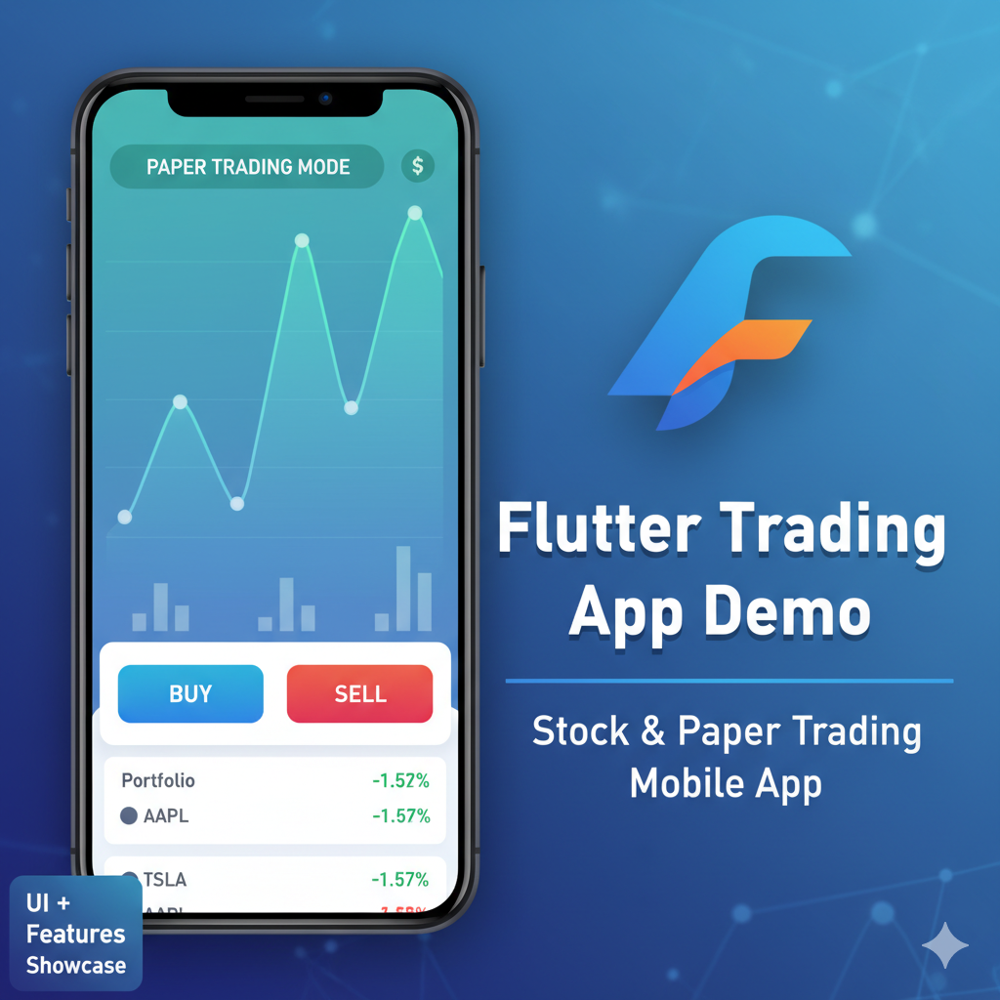
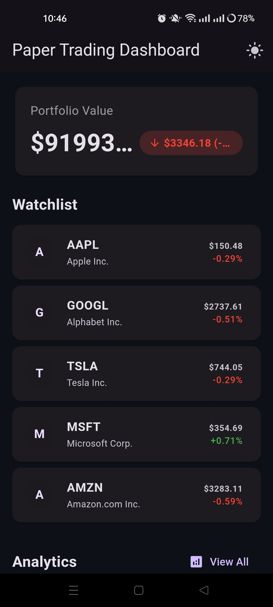

# 📱 Flutter Trading App

<div align="center">
  
  
  
  
  
  **A modern, feature-rich mobile trading application built with Flutter**
  
  *Practice trading without risk in a beautifully designed, professional interface*

  [](https://www.youtube.com/watch?v=CTuRE5X5Ew8&list=LL)

</div>

---

## 🌟 Overview

This Flutter trading application prototype demonstrates a complete mobile trading experience with real-time data visualization, paper trading capabilities, and a sleek, modern interface. Built entirely with Flutter widgets, the app showcases best practices in mobile finance app development.

## 🎬 Demo Video

<div align="center">
  
  [](https://www.youtube.com/watch?v=CTuRE5X5Ew8&list=LL)
  
  *Click the thumbnail above to watch the full demo on YouTube*
  
</div>

**What you'll see in the demo:**
- 📊 Real-time stock charts in action
- 💰 Paper trading workflow
- 🎨 Smooth UI animations and transitions  
- ⚡ App performance across different screens

## ✨ Features

### 📊 **Real-Time Trading**
- Live stock price updates
- Interactive candlestick charts
- Technical indicators & analysis tools
- Market depth visualization

### 💰 **Paper Trading**
- Risk-free practice environment
- Virtual portfolio management
- Real-time profit/loss tracking
- Trade history & analytics

### 🎨 **Modern UI/UX**
- Clean, intuitive interface
- Responsive design for all screen sizes
- Smooth animations & transitions
- Dark/Light theme support

### ⚡ **Performance**
- Optimized Flutter widgets
- Efficient state management
- Smooth 60fps animations
- Fast data loading & caching

## 📱 Screenshots

<div align="center">
  
### Main Trading Interface


### Portfolio Dashboard


### Stock Charts


### Trade Execution


</div>

> **Note**: Create a `screenshots` folder in your repository root and add your app screenshots there. Recommended image size: 375x812 pixels (iPhone dimensions) for consistency.

## 🚀 Getting Started

### Prerequisites

- Flutter SDK (>=3.0.0)
- Dart SDK (>=3.0.0)
- Android Studio / VS Code
- iOS Simulator / Android Emulator

### Installation

1. **Clone the repository**
   ```bash
   git clone https://github.com/yourusername/flutter-trading-app.git
   cd flutter-trading-app
   ```

2. **Install dependencies**
   ```bash
   flutter pub get
   ```

3. **Run the application**
   ```bash
   flutter run
   ```

### Build for Production

```bash
# Android
flutter build apk --release

# iOS
flutter build ios --release
```

## 🏗️ Architecture

```
lib/
├── models/           # Data models
├── services/         # API & business logic
├── screens/          # UI screens
├── widgets/          # Reusable components
├── utils/            # Helper functions
├── providers/        # State management
└── main.dart         # App entry point
```

## 🛠️ Tech Stack

- **Framework**: Flutter 3.x
- **Language**: Dart
- **State Management**: Provider/Riverpod
- **Charts**: FL Chart
- **HTTP Client**: Dio
- **Local Storage**: Hive
- **Architecture**: MVVM Pattern

## 📊 Key Components

### Trading Engine
- Real-time market data integration
- Order management system
- Portfolio calculations
- Risk management tools

### UI Components
- Custom chart widgets
- Animated transitions
- Responsive layouts
- Gesture handling

## 🔧 Configuration

### API Setup
1. Create a `.env` file in the project root
2. Add your API credentials:
   ```env
   API_KEY=your_api_key_here
   BASE_URL=https://api.example.com
   ```

### Firebase Setup (Optional)
1. Add your `google-services.json` (Android) or `GoogleService-Info.plist` (iOS)
2. Configure authentication and database rules

## 🤝 Contributing

We welcome contributions! Please see our [Contributing Guide](CONTRIBUTING.md) for details.

1. Fork the repository
2. Create your feature branch (`git checkout -b feature/AmazingFeature`)
3. Commit your changes (`git commit -m 'Add some AmazingFeature'`)
4. Push to the branch (`git push origin feature/AmazingFeature`)
5. Open a Pull Request

## 📝 License

This project is licensed under the MIT License - see the [LICENSE](LICENSE) file for details.

## 🙏 Acknowledgments

- Flutter team for the amazing framework
- Chart.js community for inspiration
- Trading API providers for data access
- Open source contributors

## 📞 Contact

**Your Name** - [@yourtwitter](https://twitter.com/yourtwitter) - your.email@example.com

📺 **YouTube Demo**: [Flutter Trading App Walkthrough](https://www.youtube.com/watch?v=CTuRE5X5Ew8&list=LL)

Project Link: [https://github.com/yourusername/flutter-trading-app](https://github.com/yourusername/flutter-trading-app)

---

<div align="center">
  
  **⭐ Star this repo if you found it helpful!**
  
  Made with ❤️ and Flutter
  
</div>
