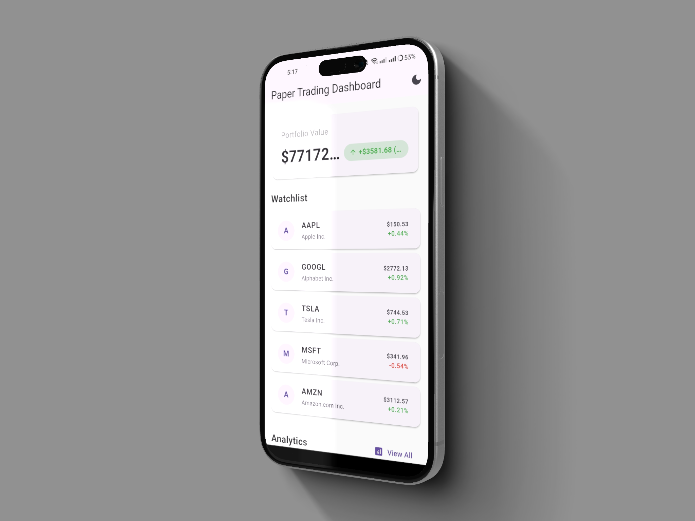
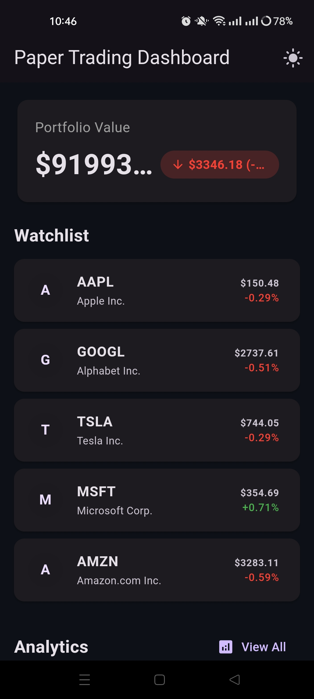
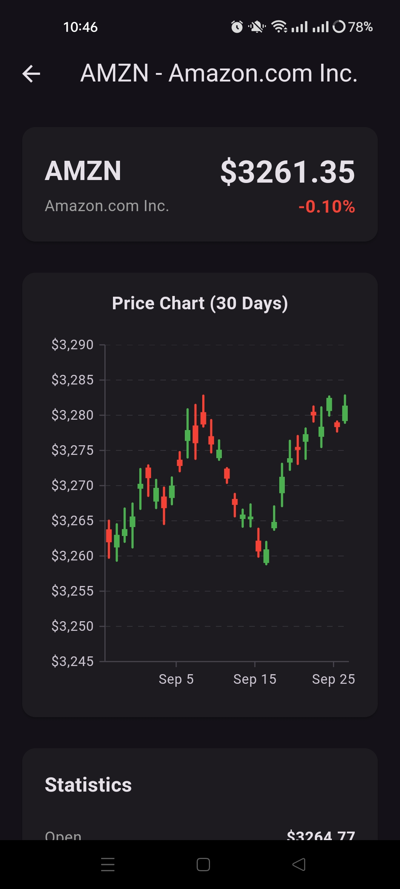
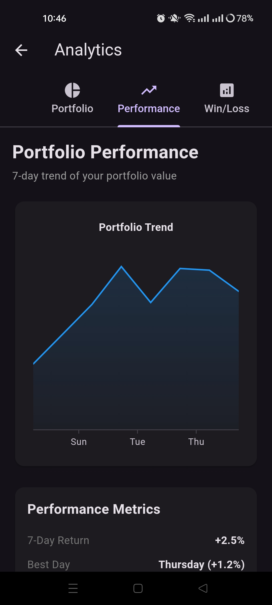
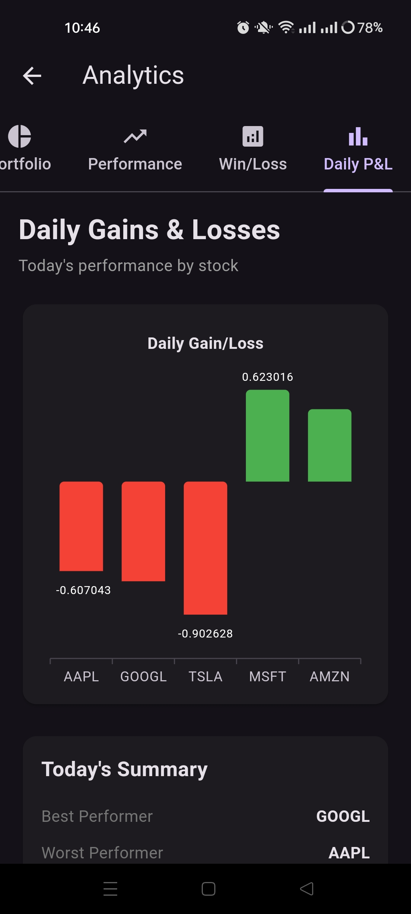

# 📱 Flutter Trading App

<div align="center">
  
  
  
  
  
  **A modern, feature-rich mobile trading application built with Flutter**
  
  *Practice trading without risk in a beautifully designed, professional interface*

  [](https://www.youtube.com/watch?v=CTuRE5X5Ew8&list=LL)

</div>

---

## 🌟 Overview

This Flutter trading application prototype demonstrates a complete mobile trading experience with real-time data visualization, paper trading capabilities, and a sleek, modern interface. Built entirely with Flutter widgets, the app showcases best practices in mobile finance app development.

## 🎬 Demo Video

<div align="center">
  
  [](https://www.youtube.com/watch?v=CTuRE5X5Ew8&list=LL)
  
  *Click the thumbnail above to watch the full demo on YouTube*
  
</div>

**What you'll see in the demo:**
- 📊 Real-time stock charts in action
- 🎨 Smooth UI animations and transitions  
- ⚡ App performance across different screens

## ✨ Features

### 📊 **Real-Time Trading**
- Live stock price updates
- Interactive candlestick charts
- Technical indicators & analysis tools

### 🎨 **Modern UI/UX**
- Clean, intuitive interface
- Smooth animations & transitions
- Dark/Light theme support

### ⚡ **Performance**
- Optimized Flutter widgets
- Smooth 60fps animations
- Fast data loading & caching

## 📱 Screenshots
<div align="center">
  
  
    
</div>

<div align="left">
  <table>
    <tr>
      <td></td>
      <td></td>
      <td></td>
      <td></td>

  </table>
</div>


## 🏗️ Tech Stack

| Technology              | Description                                             |
| ----------------------- | ------------------------------------------------------- |
| **Flutter**             | Cross-platform framework for building native interfaces |
| **Dart**                | Programming language used to develop Flutter apps       |

---

## ⚙️ Installation & Setup

Follow these simple steps to set up and run the project locally:

### 1️⃣ Clone the Repository

```bash
git clone https://github.com/<your-username>/Flutter-Quiz-App.git
cd Flutter-Quiz-App
```

### 2️⃣ Install Dependencies

```bash
flutter pub get
```

### 3️⃣ Run the Application

```bash
flutter run
```

---

## 🧩 Learning Outcomes

By working on this project, beginners can:

* Understand **Flutter widget structure** and **navigation**.
* Learn how to use **state management** effectively.
* Practice **UI design** and **user interaction logic**.
* Build confidence in structuring a small yet complete Flutter project.

---

## 🤝 Contributing

Contributions are welcome! If you'd like to improve the app or add new features:

1. Fork the repository
2. Create a new branch (`git checkout -b feature-name`)
3. Commit your changes (`git commit -m 'Add new feature'`)
4. Push to your branch (`git push origin feature-name`)
5. Open a Pull Request 🚀

---
🧠 Flutter Development Environment Setup

This project is built using Flutter. Below are the essential details and configuration requirements for replicating the development environment.

| Component              | Details                                      |
| ---------------------- | -------------------------------------------- |
| **Flutter Version**    | 3.27.1 (Stable Channel)                      |
| **Framework Revision** | 17025dd882                                   |
| **Engine Revision**    | cb4b5fff73                                   |
| **Dart Version**       | 3.6.0                                        |
| **DevTools Version**   | 2.40.2                                       |
| **Operating System**   | Windows 10 (Version 10.0.26200.6725, 64-bit) |
| **Locale**             | en-US                                        |


💻 Android Studio

* Version: 2023.3
* Java Runtime: OpenJDK 17 (17.0.10+0--11572160)


## 💬 Connect

For questions, feedback, or collaborations:

📧 **[My Email](coolmax17787@gmail.com)**
🐦 **[Follow me on X (Twitter)](https://x.com/KishanP07684084)**
💼 **[LinkedIn](https://www.linkedin.com/in/hom-bdr-pathak-01a3bb210)**

---

> 🌟 *If you find this project helpful or inspiring, don't forget to star the repo and share it with your network!*

  **⭐ Star this repo if you found it helpful!**
  
  Made with ❤️ and Flutter
  
</div>
